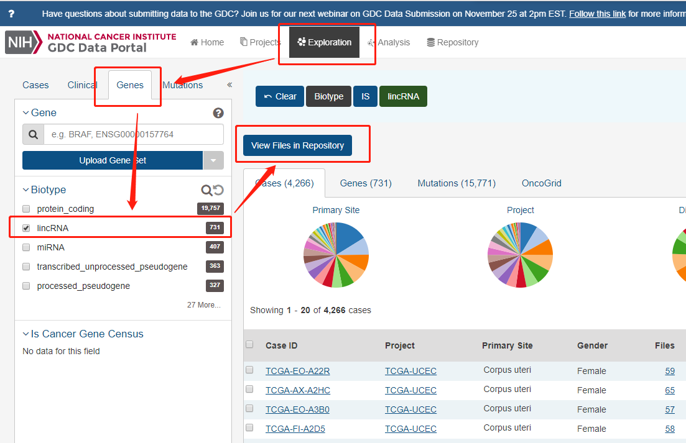

### How to download RNA-Seq files used in this study?

1. Download GDC transfer tool (https://gdc.cancer.gov/access-data/gdc-data-transfer-tool) 
2. Download metadata as descript in below figures and use the GDC transfer tool to download RNA-Seq data (FPKM files).
 
 

### How to download clinical data used in this study?

Download corresponding clinical data from the TCGA data portal (https://portal.gdc.cancer.gov/) by select patient studies containing lncRNAs, as below:

 

### How to preprocess RNA-Seq files and clinical dataset?

You can use the processing code we provided to convert FPKM files into a single genome-wide dataset, and drop invalid clinical samples at the same time.

### Precached and preprocessed data

Precached metadata for downloading FPKM files: gdc_manifest.2018-09-20.txt

Precached clinical data: raw_clinical.tsv and raw_clinical.xlsx (converted from raw_clinical.tsv)

Preprocessed genome-wide dataset (geneframe_id.pkl) and clinical data (clinical_entire_cohort.xlsx)

#### geneframe_id.pkl was uploaded into external cloud storage due to the GitHub limits on large files: 

Please download from: https://cloudstor.aarnet.edu.au/plus/s/c8sCvbu7qqVMjDX
